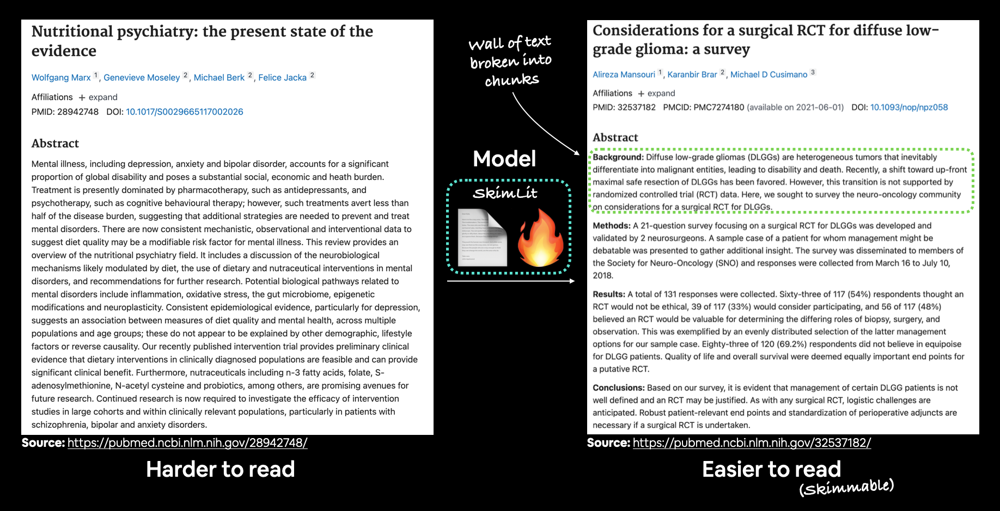

# Skim Lit !!

## Given the abstract of a RCT, predict what role each sentence serves in the abstract

This project is an extension of the project in the Zero to Mastery TensorFlow for Deep Learning course taught by Daniel Bourke
